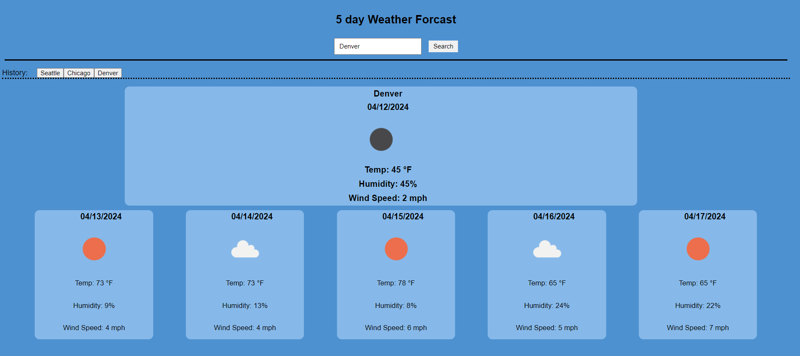

# 5 day Weather Forcast

## Description

This webpage allows a user to search a city and have a 5 day weather forcast display on the page. It will allow user to see the Name of the city they searched, the date of the weather, the temperature, humidity, and the wind speed. The user should also be able to see their last searched city's and click on them to bring them back to that weather forcast.

[Github: https://github.com/cnm724/weatherforcast](https://github.com/cnm724/weatherforcast)

[Live Link: https://cnm724.github.io/weatherforcast/](https://cnm724.github.io/weatherforcast/)

 ## Usage

## Credits

* Joem tutor - help collaborate on fetch

## License

MIT License